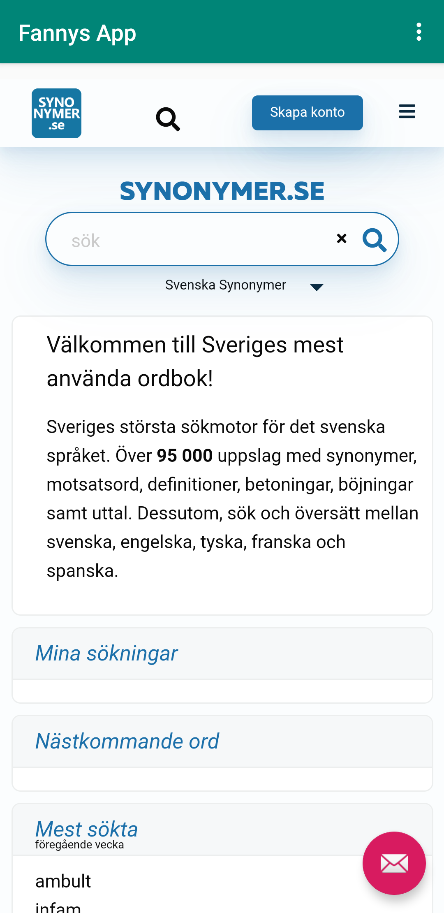

# Rapport

**Skriv din rapport här!**
Denna uppgift gjordes efter punkterna som fanns. OBS. När jag ändrade något gjordes alltid en ”Commit och Push”.

- Den första punkten var att ”Fork:a” ett befintligt projekt som fanns på Github, via LenaSYS/mobileapp-programming-webview.
Här sparar man URL koden och medför den i sitt projekt , med hjälp av ”Get from Version Control”. Nu har man tillgång till skolans projekt.


- Nästa var att ändra namn på appen, i detta fall heter appen ”Fannys App”
 ```
    <string name="app_name">Fannys App</string>
 ```


- Nästa steg var att skaffa tillgång till Internet, då lades denna kod stycke in, i filen ”AndroidManifest.xml`”.
```
    <uses-permission android:name="android.permission.INTERNET" />
```


- Nästa steg var att skapa en WebView element, för att göra det ersattes WebView-element från den befintliga` TextView`.
```
 <WebView
    android:id="@+id/my_webview"
    android:layout_width="match_parent"
    android:layout_marginTop="70dp"
    android:layout_height="match_parent"
  />
```

- Nästa steg var att skapa ett ID till WebView elementet :
  ```
      android:id=”@+id/my_webview"
   ```


- Nästa steg var att skapa ett ”Private member variable” som ska heta ”myWebView”.

```
  private WebView myWebView;
```

Sedan ska man instanserna den innanför ”onCreate()” funktionen.
Först lades denna en kod in (som var fel). Koden behövdes ändras på grund av att man redan hade definierat den sedan
innan (private WebView myWebView;). Därför gjordes denna ändring.
Från:
 ```
 WebView myWebView = (WebView) findViewById(R.id.my_webview);
 ```
Till:
 ```
 myWebView = findViewById(R.id.my_webview);
```


- Nästa steg var att lägga till ”Javascript execution” i min WebViewClien. Här lades denna kod in under tidigare kod stycke,
innanför onCreate() funktionen.
```
    WebSettings webSettings = myWebView.getSettings();
    webSettings. setJavaScriptEnabled (true);
```


-Nästa steg var att skapa en html fil som man hade tillgång (asset) till, i detta fall hette filen assignment2.html.
I filen skapades en enkel sida som hade en rubrik som lydde ”Fannys Internal Webpage”.


- Nästa steg var att man skulle implementera  en External Webpage och en Internal Webpage med hjälp av ”loadURL.
I external webpage skrevs endast en URL kod in innanför ”public void showExternalWebPage funktionen, det beror på att det är det ända man ska göra. Man kan göra på två sätt, man kan skapa en webview, antingen använder man ”findViewById eller new WebView. Felet innan var att båda användes, förutom det användes fel variabel namn. Man kan använda samma variabel när man vill kunna byta hemsida i samma webview, med det sagt ska man använda samma variabel alltså, myWebView

```
public void showExternalWebPage(){
    myWebView.loadUrl("https://synonymer.se//");
}
```


I internal Webpage skulle man få upp sin egna html fil.
Här behövdes endast URL koden för min html fil, som lades innanför ”public void showInternalWebPage funktionen.

```
public void showInternalWebPage(){
    myWebView.loadUrl("file:///android_asset/assignment2.html");
}
```


Koden som fanns innan skulle läggas in i funktionen under/efter findViweByID annars kommer inte myWebView inte innehålla något värde.
`
```
    protected void onCreate(Bundle savedInstanceState) {
        super.onCreate(savedInstanceState);
    WebViewClient myWebViewClient = new WebViewClient();
    myWebView.setWebViewClient(myWebViewClient);`
    }

```

Här är bilder från uppgiften



INSTRUKTIONER

## Följande grundsyn gäller dugga-svar:

- Ett kortfattat svar är att föredra. Svar som är längre än en sida text (skärmdumpar och programkod exkluderat) är onödigt långt.
- Svaret skall ha minst en snutt programkod.
- Svaret skall inkludera en kort övergripande förklarande text som redogör för vad respektive snutt programkod gör eller som svarar på annan teorifråga.
- Svaret skall ha minst en skärmdump. Skärmdumpar skall illustrera exekvering av relevant programkod. Eventuell text i skärmdumpar måste vara läsbar.
- I de fall detta efterfrågas, dela upp delar av ditt svar i för- och nackdelar. Dina för- respektive nackdelar skall vara i form av punktlistor med kortare stycken (3-4 meningar).

Programkod ska se ut som exemplet nedan. Koden måste vara korrekt indenterad då den blir lättare att läsa vilket gör det lättare att hitta syntaktiska fel.

```
function errorCallback(error) {
    switch(error.code) {
        case error.PERMISSION_DENIED:
            // Geolocation API stöds inte, gör något
            break;
        case error.POSITION_UNAVAILABLE:
            // Misslyckat positionsanrop, gör något
            break;
        case error.UNKNOWN_ERROR:
            // Okänt fel, gör något
            break;
    }
}
```

Bilder läggs i samma mapp som markdown-filen.


Läs gärna:

- Boulos, M.N.K., Warren, J., Gong, J. & Yue, P. (2010) Web GIS in practice VIII: HTML5 and the canvas element for interactive online mapping. International journal of health geographics 9, 14. Shin, Y. &
- Wunsche, B.C. (2013) A smartphone-based golf simulation exercise game for supporting arthritis patients. 2013 28th International Conference of Image and Vision Computing New Zealand (IVCNZ), IEEE, pp. 459–464.
- Wohlin, C., Runeson, P., Höst, M., Ohlsson, M.C., Regnell, B., Wesslén, A. (2012) Experimentation in Software Engineering, Berlin, Heidelberg: Springer Berlin Heidelberg.
